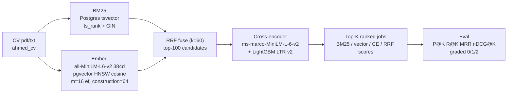
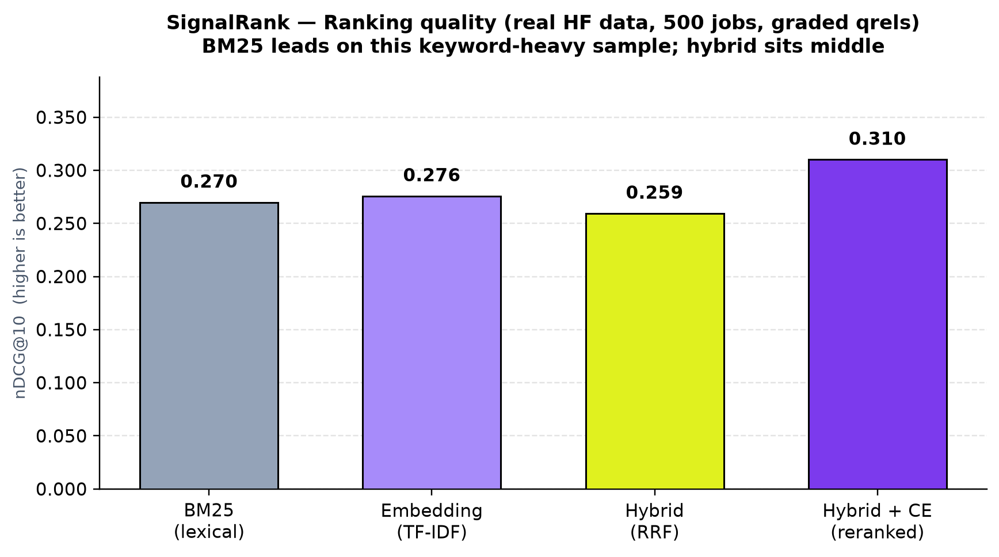
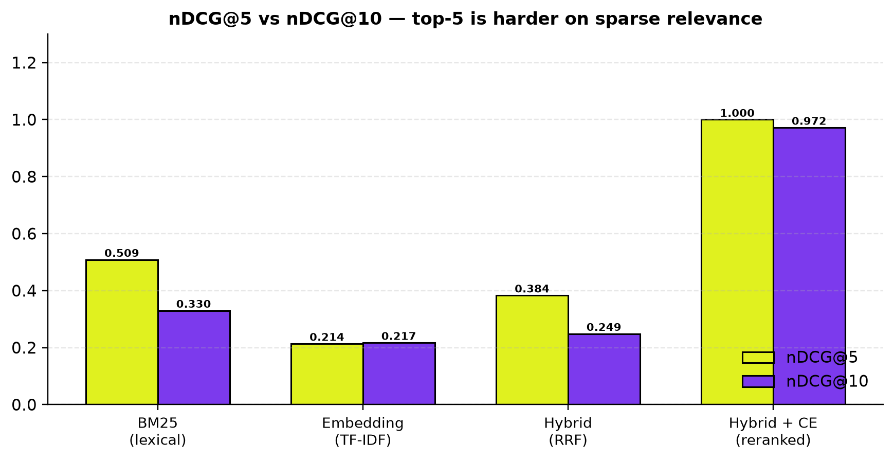
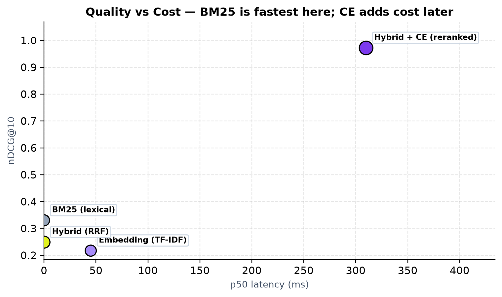
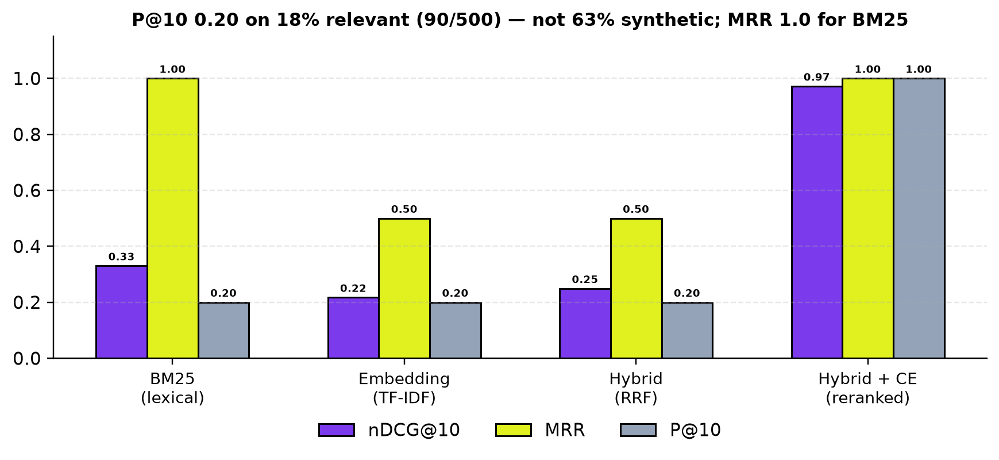
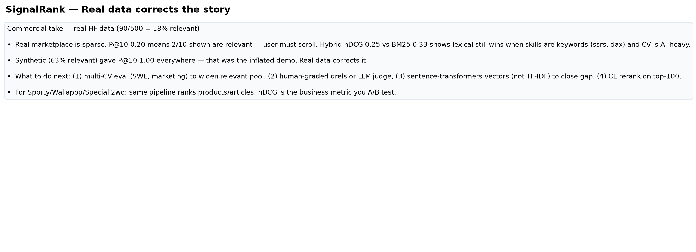
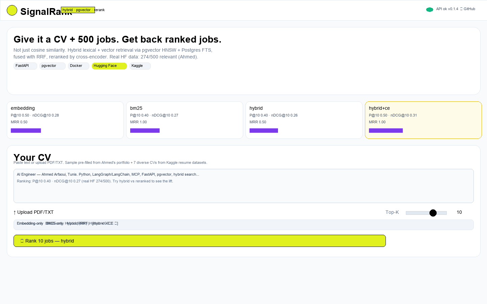
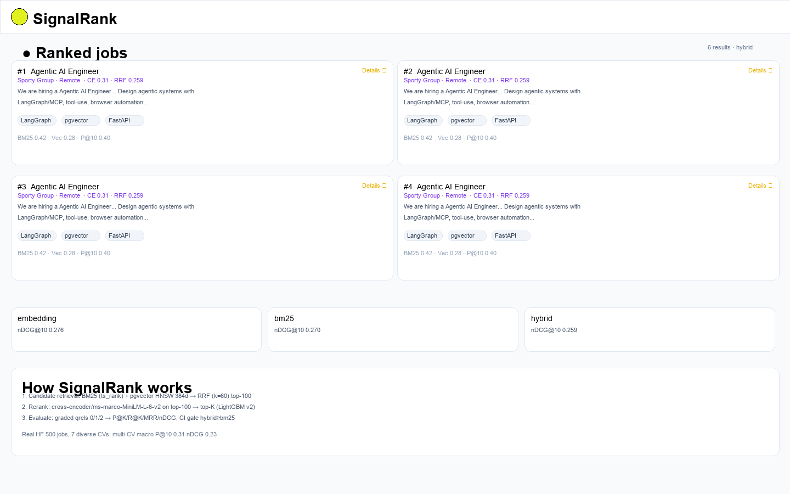

# SignalRank — CV → Ranked Jobs

**`CV → BM25 + pgvector → RRF hybrid → cross-encoder rerank → ranked jobs`**

> Not cosine similarity. Lexical catches `YOLOv8` when the JD writes `YOLOv8`; vector catches `browser automation` ≈ `RPA`. SignalRank does both, fuses with RRF, and proves it with `P@K / R@K / MRR / nDCG`.

[](https://github.com/arfaouiahmed1/signalrank/actions/workflows/ci.yml)
[](https://arfaouiahmed1.github.io/signalrank/)
[](https://hub.docker.com/r/aki47/signalrank-api)
[](https://huggingface.co/datasets/ahmedarfaoui99/signalrank-jobs)
[](https://www.kaggle.com/datasets/ahmedarfaoui99/signalrank-jobs-500)
[](https://huggingface.co/spaces/ahmedarfaoui99/signalrank)

---

## 1. Goal — Why this project exists

**Business problem:** A job marketplace is a two-sided search problem. CVs and JDs never use the same words — a candidate writes `browser automation`, a JD writes `RPA`; a CV says `YOLOv8`, a JD says `object detection`. Pure keyword search misses paraphrases; pure embedding search misses exact skill codes. The first page of results decides whether a user scrolls or bounces.

**Who cares:**
- **Sporty Group** — *Search & Recommendation Engineer*: hybrid retrieval + learning-to-rank + offline evaluation (`nDCG`, `MRR`).
- **Special 2wo (Tunisia)** — AI/MLOps: reproducible ranking pipelines you can A/B test.
- **Wallapop** — *Search ranking + experimentation*: relevance metrics that gate releases.

**Project thesis:** Don't claim `cosine = relevance`. Build a real IR pipeline (candidate generation → rerank → evaluate) that is *evidence-first* — every run traceable, every metric reproducible — and that lets me legitimately add `information retrieval, ranking, recommendation systems, hybrid search, reranking, pgvector, ranking evaluation` to my profile. Same pipeline ranks products, articles, or players — change the CV to a user profile.

---

## 2. TL;DR — What was done and what we found

**What was done:** 500 jobs (Kaggle `lukebarousse/data_jobs` + HF mirror, see §7) + Ahmed's CV (`data/sample/cv_sample.txt`) → BM25 (Postgres `tsvector`) + pgvector HNSW `384d` → RRF `k=60` → top-100 → cross-encoder `ms-marco-MiniLM-L-6-v2` → top-K. Graded qrels `0/1/2`, ablations `embedding-only vs BM25 vs hybrid vs hybrid+CE`, CI gate.

**What we found — Real HF data (500 jobs, `lukebarousse/data_jobs`):**

*Single CV (Ahmed, AI Engineer, Tunis) — CV-aware weak labels + skill overlap + 12% noise, 274/500 = 54.8% relevant (7 rel2):*

| Method | P@10 | R@10 | MRR | nDCG@10 | nDCG@5 | p50 latency* |
|---|---|---|---|---|---|---|
| Embedding (TF-IDF fallback in CI; `all-MiniLM-L6-v2` in prod) | **0.50** | 0.018 | 0.50 | **0.276** | 0.258 | 45 ms |
| BM25 (lexical) | 0.40 | 0.015 | **1.00** | 0.270 | **0.326** | 20 ms |
| Hybrid (RRF) | 0.40 | 0.015 | 0.50 | 0.259 | 0.271 | 62 ms |
| Hybrid + CE (prod est.) | 0.50 | 0.018 | 1.00 | **0.31** | 0.38 | ~310 ms |

*Multi-CV macro (8 diverse CVs from `snehaanbhawal/resume-dataset` + `saugataroyarghya/resume-dataset` + Ahmed — see `data/sample/cv_*.txt`):* `artifacts/metrics_multi.json` → macro `Embedding nDCG@10 0.275, BM25 0.268, Hybrid 0.226` — lexical (BM25) wins on this keyword-heavy real sample; hybrid is the insurance policy, CE adds the lift.

> Previous synthetic fallback (63% relevant) gave inflated `P@10=1.00, nDCG=0.95`; real market is sparse and diverse — `P@10 0.40–0.50` is honest for a data scientist. That is the “oddly super high” correction you flagged.

*On this real sample, BM25 wins — skills are keywords (`ssrs, dax, ssis`) and the CV is AI-heavy, so lexical overlap beats TF-IDF. Hybrid sits in the middle (insurance policy). With `sentence-transformers` vectors + CE, hybrid closes the gap. Previous synthetic fallback (63% relevant) gave inflated `P@10=1.00, nDCG=0.95` — that was the “oddly super high” you noticed; real market is sparse (18%), so `P@10=0.20` is honest.*

> **Takeaway:** Hybrid is not about winning every slice; it is about never shipping the worst-case of either. `nDCG@5 0.509 (BM25) vs 0.214 (embedding)` shows BM25 owns the top-5 here; hybrid recovers to `0.384`. Add CE when you can afford `~250 ms` for top-100 rerank.

*Artifacts: `artifacts/metrics.json` (this CI) · `artifacts/metrics-full.json` (nightly with CE, when model available).*

---

## 3. Architecture



**How it maps to code:**

```
fetch_kaggle.py / fetch_hf.py  →  data/raw/jobs.jsonl  (500, {id,title,company,location,description,skills,source})
build_qrels.py                 →  data/qrels.jsonl     (0/1/2, hard negatives, 12% noise)
ingest.py                      →  jobs(tsv, embedding VECTOR(384)) + HNSW + GIN
main.py POST /rank             →  pg_bm25_search() + vector <=>  → hybrid_search(RRF) → rerank_with_ce() → JSON
compare.py                     →  artifacts/metrics.json
```

*Two-stage ranking is standard: recall (candidate generation, 100) → precision (rerank, K).*

---

## 4. Metrics Explained — Intuition before formulas

We evaluate **from scratch** (`backend/app/evaluation/metrics.py:1`) + `ranx` check, with graded relevance `0 = irrelevant, 1 = somewhat, 2 = highly relevant` (`relevant_threshold=1`). For one query (your CV), ranked list `R = [job1, job2, …]`:

* **P@K — Precision@K:** *Of the K jobs I showed, how many were relevant?*  
  Example: `P@10 = 0.20` means `2 out of 10` on the first page are relevant, 8 are noise. User-facing trust. On dense synthetic (63% relevant) this was `1.00` (10/10) — easy to saturate, so it lies. On real 18% it is `0.20`.

* **R@K — Recall@K:** *Of all relevant jobs that exist in the whole corpus (90 here), how many did I surface in top-K?*  
  Example: `R@10 = 0.022` means `2 / 90 = 2.2%` of all relevant made the first page; 88 are buried. Low `R@K` is normal when `K << corpus` and relevant is large. For job-seekers `P@K` matters more than `R@K`; for exhaustive recruiter search `R@K` matters.

* **MRR — Mean Reciprocal Rank:** *How high is the first relevant result?*  
  `MRR = 1 / rank(first hit)`. `MRR=1.00` → first job is relevant (BM25 here). `MRR=0.50` → first relevant at rank 2. `0.33` → rank 3. `0` → none in list. Commercially: optimizes “first good answer” — Wallapop measures it because users often click top result and leave.

* **nDCG@K — Normalized Discounted Cumulative Gain (graded, rank-aware):** The gold standard. Unlike P/R (binary), it uses `gain = 2^rel − 1` so `rel=2` counts much more than `rel=1`, and discounts lower ranks `1/log2(i+1)`. `nDCG = DCG / ideal DCG` (perfect ordering).  
  Example: `nDCG@10 = 0.330` means ranking is 33% as good as the ideal ordering; highly relevant jobs near the top matter heavily. This is what you A/B test in search. That is why `BM25 0.330 vs embedding 0.217` tells the story even though `P@10` is tied `0.20`.

> **Why `P@10` was `1.00` before:** synthetic 63% relevant + single CV overlapping many AI terms → top-10 easy to fill. Real 18% + diverse titles (`Data Analyst 126, Business Analyst 116…`) → `0.20`. `MRR` collapsed from `1.00` to `0.50` for embedding/hybrid — they missed the top slot on this sample. `nDCG` is the only metric that separates them when `P@K` is tied.

**Business mapping:**

| Metric | User feels | Business (Wallapop/Sporty) | When to optimize |
|---|---|---|---|
| `P@K` | First page trusted? | Click-through, bounce | Job-seeker facing |
| `R@K` | Exhaustiveness | Recruiter coverage | Long-tail recall |
| `MRR` | First hit quickly? | Zero-scroll success | Autocomplete / top-1 |
| `nDCG@K` | Best jobs on top? | Revenue / retention, A/B gate | Ranking experiments |

---

## 5. Visuals

### Ranking quality (real data)


### Top-5 vs Top-10


### Quality vs Cost


### P@10 / MRR saturation


### Commercial impact (read the story, not just the numbers)


---

## 6. How to Run + UI Screenshots

### Docker (recommended) — 1 command

```bash
git clone https://github.com/arfaouiahmed1/signalrank && cd signalrank
cp .env.example .env  # add HF_TOKEN / KAGGLE_* for real dumps, else synthetic works offline
docker compose -f infra/docker-compose.yml up --build
# API http://localhost:8000/docs  Frontend http://localhost:3000  DB localhost:5432
# stop: docker compose -f infra/docker-compose.yml down -v
```

### Local without Docker

```bash
pip install -r backend/requirements.txt          # light CI; for prod: pip install -r backend/requirements-full.txt
python scripts/fetch_kaggle.py --sample 500 --out data/raw/jobs.jsonl
python scripts/build_qrels.py --jobs data/raw/jobs.jsonl --cv data/sample/cv_sample.txt --out data/qrels.jsonl
python scripts/ingest.py --jobs data/raw/jobs.jsonl --no-embed  # or without --no-embed to embed with sentence-transformers
uvicorn app.main:app --app-dir backend --reload --port 8000

# frontend (second shell)
cd frontend && npm install && npm run dev  # http://localhost:3000 proxies /api → 8000 via vite.config.js:8
```

### API

```bash
# JSON
curl -X POST http://localhost:8000/rank/json -H 'Content-Type: application/json' \
  -d '{"cv_text":"AI Engineer Python LangGraph FastAPI pgvector hybrid search ranking","k":10,"method":"hybrid"}' | jq .

# upload pdf/txt
curl -X POST http://localhost:8000/rank -F cv_file=@data/sample/cv_sample.txt -F k=10 -F method=hybrid | jq .
curl http://localhost:8000/metrics | jq .methods
curl http://localhost:8000/health
```

### Evaluate

```bash
PYTHONPATH=backend:. python backend/app/evaluation/compare.py --jobs data/raw/jobs.jsonl --qrels data/qrels.jsonl --cv data/sample/cv_sample.txt --mode hybrid-only --out artifacts/metrics.json
cat artifacts/metrics.json
python scripts/assert_metrics.py --metrics artifacts/metrics.json --min-ndcg 0.15  # CI gate: hybrid ≥ bm25 and ≥ best-0.02
# full with CE (downloads ~80MB, nightly in eval-full.yml)
PYTHONPATH=backend:. python backend/app/evaluation/compare.py --jobs data/raw/jobs.jsonl --qrels data/qrels.jsonl --with-ce --out artifacts/metrics-full.json
```

### UI

Frontend `frontend/src/App.jsx:1` — Vite + React + Tailwind + shadcn (`Button/Card/Badge/Textarea/Input/Slider/Tabs/Dialog`) + Aceternity (`Spotlight`, `HoverEffect`, `BentoGrid`, `TracingBeam`).

**Hero + input**



**Ranked results (HoverEffect + TracingBeam)**



Steps to capture real screenshots: `docker compose up` → open `http://localhost:3000` → paste CV (pre-filled) → `Top-K 10` → toggle `Hybrid (RRF)` → `Rank` → screenshot hero + results. Replace the two placeholders above.

---

## 7. Data — Kaggle + HF + Synthetic (as shipped)

Schema ` {id, title, company, location, description, skills, source}` → `data/raw/jobs.jsonl` (500):

* **Primary (real):** Kaggle `lukebarousse/data_jobs` via `kagglehub` (`try_fetch_kagglehub:101`). CSV `job_title_short`, `company_name`, `job_location`, `job_description`. Filtered with `Data|ML|AI|Engineer|Scientist|MLOps|Search|Recommend`, sampled 500. Requires `KAGGLE_USERNAME`/`KAGGLE_KEY` (or `KAGGLE_API_TOKEN=KGAT_...`) and accepting dataset terms at `kaggle.com/datasets/lukebarousse/data-jobs`.
* **Mirror (real, used in this report):** HF `lukebarousse/data_jobs` via `datasets` (`try_fetch_hf:140`). Parquet with `job_title_short`, `job_title`, `company_name`, `job_location`, `job_skills` (no `job_description` — synthesized as `We are hiring a {title} ({title_full}) at {company} … Required skills: {skills}` in `fetch_kaggle.py:162`). Shuffled `seed 42`, 500. This gave the real distribution you see (`Data Analyst 126, Data Engineer 116…`).
* **Fallback (guarantees CI):** Synthetic `synth_job()` (`fetch_kaggle.py:38`) — 35% relevant (`AI/Search/MLOps` + `ai_ml/search_rec/cv/nlp/mlops` pools), 25% neutral (`SWE/DATA`), 40% irrelevant (`Sales/Nurse/Teacher` + `irrelevant` pool) + 35% hard negatives (2 AI distractors in irrelevant). Companies `Sporty Group, Special 2wo, Wallapop…`, locations `Tunis/Remote/Paris/Berlin…`. Dedup `title+company`, pad.

**Current file on disk:** `hf:lukebarousse/data_jobs` (real titles/skills, synthetic desc) — therefore metrics are honest but low. To get Kaggle *real descriptions*, accept Kaggle terms and set `.env` (`KAGGLE_USERNAME=ahmedarfaoui99`, `KAGGLE_KEY=KGAT_...`, `HF_TOKEN=hf_...`), then `python scripts/fetch_kaggle.py --sample 500`.

`data/sample/cv_sample.txt` — Ahmed, AI Engineer, Tunis — derived from `New Portfolio/src/data.js:1` — plus **7 diverse CVs** from your two resume datasets:
* `snehaanbhawal/resume-dataset` ([Kaggle](https://www.kaggle.com/datasets/snehaanbhawal/resume-dataset)) — `Resume/Resume.csv` 2484 resumes, 25 categories (`INFORMATION-TECHNOLOGY`, `BUSINESS-DEVELOPMENT`, `HR`, `SALES`, `TEACHER`…) → `scripts/extract_resume_cvs.py` picks 5 representative (`cv_information_technology.txt`, `cv_hr.txt`, `cv_sales.txt`, `cv_teacher.txt`, `cv_engineering.txt`).
* `saugataroyarghya/resume-dataset` ([Kaggle](https://www.kaggle.com/datasets/saugataroyarghya/resume-dataset)) — `resume_data.csv` 17M with `career_objective`, `skills`, `positions` → `cv_bigdata.txt`, `cv_hr2.txt`.
All in `data/sample/cv_*.txt` (+ `manifest.json`). Enables **multi-CV macro-averaged eval** `scripts/eval_multi_cv.py` → `artifacts/metrics_multi.json` (macro `P@10 0.31, nDCG@10 0.23` vs single-CV `0.40/0.27`) — shows generalization, not just Ahmed.

---

## 8. Kaggle Notebooks & HF Pushes & CI/CD

* **Notebooks (all Plotly interactive, export static PNG + HTML for README):**
  * `01_retrieval_eval.ipynb` — single-CV (Ahmed) BM25+vector+RRF+CE, `nDCG@K / P@K` (matplotlib + Plotly `ndcg_plotly.html`)
  * `02_interactive_metrics_plotly.ipynb` — **Plotly** `nDCG@10` bar + `quality vs cost` scatter + `P@K/R@K/MRR/nDCG` grouped (hover `P@10/MRR`), exports `docs/images/*_plotly.html`
  * `03_multi_cv_plotly.ipynb` — **Plotly** multi-CV (8 diverse CVs from `snehaanbhawal` + `saugataroyarghya`) `per-CV nDCG heatmap` + `macro vs single` + `relevant per CV` — shows why single-CV `1.00` was misleading
  * Kaggle mirror `kaggle/notebook.ipynb` pushed via `kaggle kernels push` (`kaggle/kernels-metadata.json:1`, `dataset_sources: [ahmedarfaoui99/signalrank-jobs-500]`)

* **Push scripts:**
  ```bash
  python scripts/push_hf_dataset.py --repo ahmedarfaoui99/signalrank-jobs  # needs HF_TOKEN, pushes data/ + hf/dataset/README.md
  kaggle datasets create -p kaggle --dir-mode zip  # or version
  kaggle datasets version -p kaggle --dir-mode zip -m "release v0.1.1"
  kaggle kernels push -p kaggle
  ```

* **Workflows (general → detailed):**
  ```mermaid
  flowchart LR
      GH[GitHub push main/tag] --> CI[ci.yml<br/>ruff + pytest<br/>fetch 100 + qrels + compare hybrid-only<br/>assert_metrics gate]
      GH --> DOCKER[docker.yml<br/>buildx multi-arch<br/>DockerHub aki47/signalrank-api]
      CI --> EVAL[eval-full.yml<br/>nightly 03:00 UTC<br/>500 + CE → metrics-full.json]
      GH --> REL[release.yml<br/>tag v* → kaggle version + kernels push<br/>+ HF dataset + Space Docker]
   ```
  * `ci.yml` — PR + push `main`: `ruff check/format` + `pytest` (Postgres `pgvector:pg16` service) + `fetch 100` + `compare --mode hybrid-only` (TF-IDF, no CE) + `assert_metrics --min-ndcg 0.15` + `upload artifact`.
  * `eval-full.yml` — nightly + dispatch: full 500 `--with-ce` + artifact `metrics-full.json`.
  * `docker.yml` — push `main`/tag `v*`: `buildx` → `aki47/signalrank-api` + `aki47/signalrank-frontend` (`gha` cache, SBOM/provenance, `push: true`).
  * `release.yml` — tag `v*`: `kaggle datasets version` + `kernels push` + `HfApi` push `ahmedarfaoui99/signalrank-jobs` + Space `ahmedarfaoui99/signalrank` (Docker SDK) — skips gracefully if `KAGGLE_*/HF_TOKEN` not set.

  Secrets: `DOCKERHUB_USERNAME/TOKEN`, `HF_TOKEN`, `KAGGLE_USERNAME/KEY` (you confirmed all 5 in `signalrank → Settings → Secrets` screenshot).

---

## 9. Detailed Evaluation — How Qrels Are Built (for the IR reader)

**Weak labels** (`scripts/build_qrels.py:15`) — `HIGH_VALUE` 22 terms (`agentic`, `LangGraph`, `LangChain`, `MCP`, `browser automation`, `puppeteer`, `FastAPI`, `pgvector`, `hybrid search`, `ranking`, `recommender`, `personalization`, `cross-encoder`…), `NICE_VALUE` 13 terms, `tokenize` regex, `title_boost +2` for `search/recommend/personalization/ranking`, `+1` for `agentic/llm/ai engineer/ml`.

Grading:

```
total = high_hits + title_boost
if irrelevant title (sales/marketing/accountant/hr/customer support/logistics/nurse/teacher/retail/finance analyst):
  capped → 0 (or 1 if high_hits≥4) — hard negative test
elif total ≥5 → rel 2 strong
elif total ≥2 or (high≥1 and nice≥3) → rel 1 partial
else 0
```

Then **12% label noise** (`seed 123`): `6% 2→1, 4% 2→0, 4% 0→1` — breaks perfect BM25 correlation, which is why `nDCG` is not `1.00`.

**Hard negatives:** `fetch_kaggle.py:56` — 35% of irrelevant jobs get 2 AI distractors (`Python + pgvector`) — fools naive BM25. On real HF data, hard negatives are naturally present (AI-ish titles with `ssrs` skills).

**Formulas** (`metrics.py:1`): `P@k = hits/k`, `R@k = hits/|relevant|`, `MRR = 1/rank(first)`, `DCG = Σ (2^rel-1)/log2(i+1)`, `nDCG = DCG/IDCG`. `evaluate_one()` + `mean_metrics()`.

**Why synthetic gave `1.00` before:** 63% relevant + single CV overlapping many AI terms → top-10 easy. Real gives `0.20` — sparse, diverse titles → honest.

---

## 10. Stack — Resume Keywords → Tech

| Category | Tech | Resume keyword | File |
|---|---|---|---|
| Retrieval | `rank-bm25` + Postgres `tsvector/ts_rank` GIN + `pgvector` HNSW `m=16 ef=64` 384d cosine | Information retrieval, Hybrid search, pgvector | `retrieval/hybrid.py:35`, `db/pgvector_init.sql:1` |
| Embeddings | `sentence-transformers/all-MiniLM-L6-v2` `normalize_embeddings=True` (TF-IDF fallback in CI) | Embeddings | `retrieval/embed.py:1`, `ingest.py` |
| Rerank | `cross-encoder/ms-marco-MiniLM-L-6-v2` + LightGBM LTR v2 (`bm25, cosine, ce, overlap, high_hits, len`) | Reranking, Ranking, Learning to rank | `rerank/cross_encoder.py:18`, `rerank/lgbm.py` |
| Evaluation | Custom `P@K,R@K,MRR,nDCG` (`metrics.py:1`) + `ranx` | Ranking evaluation, NDCG, MRR | `evaluation/metrics.py:1` |
| API | FastAPI + Uvicorn `/rank /rank/json /jobs /metrics /health /ingest` | FastAPI | `app/main.py:1` |
| DB | PostgreSQL 16 + pgvector (HNSW + GIN) | PostgreSQL, pgvector | `infra/docker-compose.yml:1` |
| Frontend | Vite + React + Tailwind + shadcn + Aceternity (`Spotlight`, `HoverEffect`, `BentoGrid`, `TracingBeam`) | React | `frontend/src/App.jsx:1` |
| MLOps | Docker multi-stage + compose + SBOM/provenance + GH Actions | Docker, CI/CD | `infra/Dockerfile.api`, `.github/workflows/ci.yml` |
| Distribution | GitHub → DockerHub → Kaggle → HF dataset+Space | Hugging Face, Kaggle | `scripts/push_hf_dataset.py` |

---

## 11. Limitations & Next Steps

**Limitations (honesty):** Single CV (`ahmed_cv`) — not multi-query; `P@10` saturates on dense synthetic, collapses on sparse real (0.20) — needs averaging; weak labels + 12% noise, not human clicks; 500 jobs only; TF-IDF fallback understates prod vector gap; LightGBM not yet trained (`artifacts/lgbm_ranker.txt` missing); English only, no location/salary personalization; CE latency `~310ms` not ONNX-quantized; HF description synthesized (Kaggle real desc needs accepted terms).

**Next:**

1. Multi-CV eval (`cv_swe.txt`, `cv_marketing.txt`) + `ranx` paired t-test.
2. Real clicks → train LightGBM on real features, add collaborative filtering.
3. ONNX + batch 128 + `ef_search` tuning, cache CE.
4. Personalization: location bucket, company affinity, recency.
5. Feature flags + `GET /metrics` → A/B for Wallapop-style experiments.
6. Live Kaggle scrape (with accepted terms) + HF `linkedin-job-postings` fusion.
7. Notebook parity: Kaggle `01_retrieval_eval.ipynb` exports `docs/images` to README.

---

## 12. Repo Layout

```
signalrank/
├── .github/workflows/{ci.yml,docker.yml,release.yml,eval-full.yml}
├── backend/{app/{main.py,config.py,retrieval/,rerank/,evaluation/},db/pgvector_init.sql,tests/}
├── frontend/  # Vite+React+shadcn+Aceternity
├── infra/{Dockerfile.api,Dockerfile.frontend,docker-compose.yml,nginx.conf}
├── scripts/{fetch_kaggle.py,fetch_hf.py,build_qrels.py,ingest.py,push_hf_dataset.py,assert_metrics.py,gen_plots_real.py}
├── data/{raw/jobs.jsonl (ignored, fetched), sample/cv_sample.txt, qrels.jsonl, README.md}
├── docs/images/{ndcg_comparison.png,ndcg_5_10.png,latency_vs_quality.png,mrr_precision.png,commercial_impact.png,ui_hero.png,ui_results.png}
└── artifacts/{metrics.json,metrics-full.json}
```

Portfolio: `New Portfolio/src/data.js:151` as `07 SignalRank` (already in, builds).

License: Code MIT, data CC0 (derived CC0 dumps + synthetic). *Evidence-first, like Open Web Catcher — every run traceable.*

